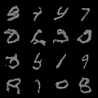
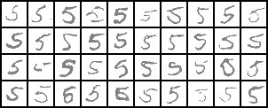

# stable_diffusion_from_scratch


## How to train
```console
// for basic model
$ python3 train.py --model ddpm

// for conditonal diffusion model
$ python3 train.py --model cond
```
The trained state dict of model will be stored in output folder.

## How to inference
The inferenced image will be stored in output folder.
```console
// for basic model
$ python3 inference.py --model ddpm
```




```console
// for conditonal diffusion model
$ python3 inference.py --model cond
```





## Reference

### Basice Diffusion Model source
https://github.com/cloneofsimo/minDiffusion

### Conditional Diffusion Model source
https://github.com/TeaPearce/Conditional_Diffusion_MNIST/tree/main

## TODO

- [ ] two image merging model